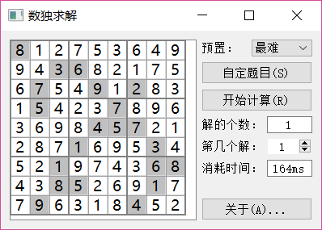

# 数独求解程序

#### 项目介绍
Qt5做的数独求解程序，可以判断数独解的个数（如果非唯一解）。

#### 运行截图

#### 源码说明
* 使用MSVC+QT5平台，故*.cpp和*.h文件均采用UTF8+BOM编码。如果切换到MinGW或GCC平台，需要转换到UTF8 without BOM编码。
* Sudoku类是使用纯C++写的，连标准容器都没使用，可以移植到其它框架使用（如MFC）。
* 使用递归回溯的算法，空间复杂度O(1)，时间复杂度O(2^n)。最难的一个示例题目在AMD Ryzen 5 1600X上求全部解用时164ms（单核3.6GHz），仍可进一步优化。

